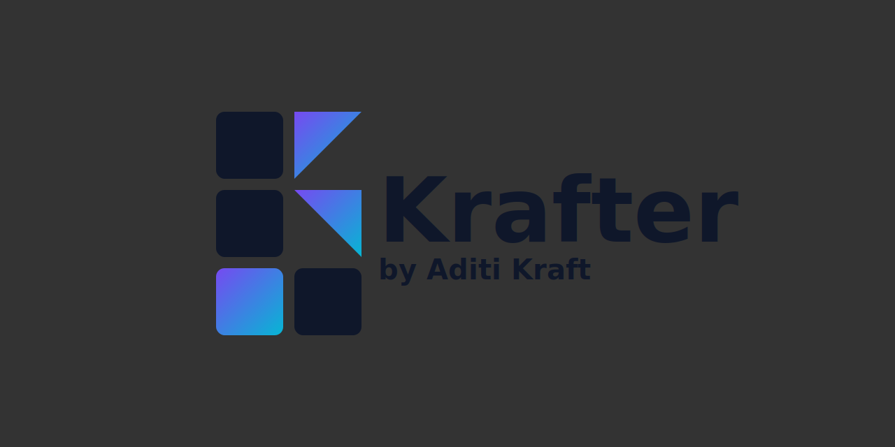
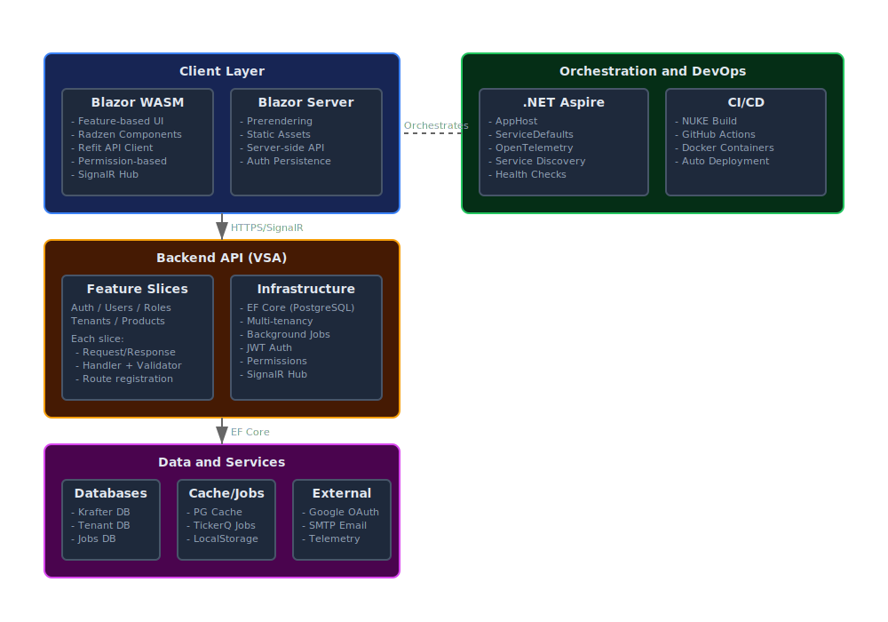
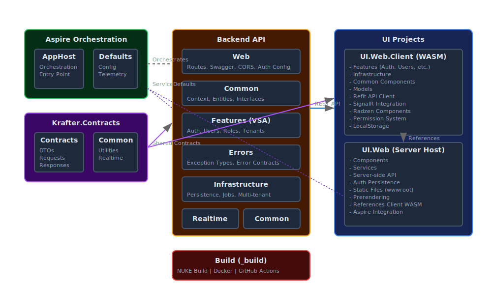

# Krafter

<p align="center">
  
</p>

> A modern .NET 10 full-stack platform built with Vertical Slice Architecture (VSA), multi-tenancy, and Blazor WebAssembly — designed for efficient AI-assisted feature development.

[](https://dotnet.microsoft.com/)
[](https://dotnet.microsoft.com/apps/aspnet/web-apps/blazor)
[](LICENSE)

## 🚀 Demo

Try the live demo at [https://krafter.getkrafter.dev/](https://krafter.getkrafter.dev/)

**Default Credentials:**
- Email: `admin@getkrafter.dev`
- Password: `123Pa$$word!`

Alternatively, log in with Google to create a new account.

## ⚡ TL;DR Quick Start

**First-time setup:**

1) Install tools (once)
- dotnet-ef: `dotnet tool install --global dotnet-ef`
- Kiota CLI (optional for client regen): `dotnet tool install --global Microsoft.Kiota.Cli`

2) Run Aspire orchestration (starts PostgreSQL, dynamic ports)
- `dotnet run --project aspire/Krafter.Aspire.AppHost/Krafter.Aspire.AppHost.csproj`

**Database migrations (first run or when schema changes):**

3) Copy DB connection string from Aspire Dashboard
- Open Aspire Dashboard (usually https://localhost:17285)
- In the **Resources** tab, expand the **postgres** resource (click the arrow > if collapsed)
- Find the **krafterDb** row (nested/indented under postgres)
- Click the **three-dot menu (⋮)** in the Actions column of the krafterDb row
- Select **"View details"** from the dropdown menu
- The details panel opens on the right showing "PostgresDatabaseResource: krafterDb"
- Scroll down in the details panel to find the **Connection string** field
- Click the **eye icon** (👁️) next to the connection string value to copy it
- Format: `Host=localhost;Port=56178;Username=postgres;Password=postgres;Database=krafterDb`
- **Note:** The port number changes with each Aspire run (e.g., 56178 in one run, 52961 in another)

4) Stop `krafter-api` service in Aspire (unlocks Backend assembly)

5) Set migration connection string
- EITHER update `src/Backend/appsettings.Local.json` → `ConnectionStrings:KrafterDbMigration`
- OR set env var: `ConnectionStrings__KrafterDbMigration="Host=localhost;Port=XXXXX;Username=postgres;Password=postgres;Database=krafterDb"`

6) Apply migrations (once)
- `cd src/Backend`
- `dotnet ef database update --context KrafterContext`
- `dotnet ef database update --context TenantDbContext`
- `dotnet ef database update --context BackgroundJobsContext`

7) Restart `krafter-api` in Aspire and open URLs
- Aspire Dashboard: https://localhost:17285
- Backend API: https://localhost:5199
- Swagger UI: https://localhost:5199/swagger
- Blazor UI: https://localhost:7291

Note: Ports are dynamic per run; use the Aspire Dashboard values.

## 📋 Table of Contents

- [TL;DR Quick Start](#tldr-quick-start)
- [Overview](#overview)
- [Architecture](#architecture)
- [Key Features](#key-features)
- [Technology Stack](#technology-stack)
- [Getting Started](#getting-started)
  - [Prerequisites](#prerequisites)
  - [Install Tools](#install-tools)
  - [Quick Start](#quick-start)
  - [Database Migrations Workflow](#database-migrations-workflow)
  - [Secrets and Configuration](#secrets-and-configuration)
  - [Troubleshooting](#troubleshooting)
- [Project Structure](#project-structure)
- [Development Guide](#development-guide)
- [Deployment](#deployment)
- [Contributing](#contributing)
- [License](#license)

## 🎯 Overview

**Krafter** is a production-ready, enterprise-grade full-stack platform built with .NET 10, combining modern architectural patterns with cutting-edge technologies. It provides a solid foundation for building scalable, multi-tenant SaaS applications with rich user interfaces.

### What Makes Krafter Special?

- **🏗️ Vertical Slice Architecture (VSA)** - Backend organized by features, not layers
- **🌐 Hybrid Blazor** - WebAssembly + Server rendering for optimal performance
- **🏢 Multi-Tenancy** - Complete tenant isolation at the database level
- **🔐 Permission-Based Security** - Fine-grained authorization with JWT
- **⚡ Real-Time Updates** - SignalR integration for live notifications
- **📊 Observability** - OpenTelemetry with Aspire orchestration
- **🎨 Modern UI** - Radzen components with theming support

## 🏛️ Architecture

### Solution Architecture Diagram



### Project Dependencies Diagram



## ✨ Key Features

### 🏗️ **Architecture**
- **Vertical Slice Architecture (VSA)** - Features organized by business capability
- **Clean Code** - Single Responsibility, DRY, SOLID principles
- **Auto-Registration** - Handlers, services, and routes discovered via markers
- **Response Pattern** - Consistent `Response<T>` wrapper for all operations

### 🔐 **Security**
- **JWT Authentication** - Secure token-based authentication
- **Google OAuth** - External authentication integration
- **Permission-Based Authorization** - Fine-grained access control
- **Multi-Tenancy** - Complete tenant isolation at DB level
- **Token Refresh** - Automatic token rotation

### 🎨 **User Interface**
- **Blazor Hybrid** - WebAssembly + Server rendering
- **Radzen Components** - 70+ professional UI components
- **Theme Support** - Light/Dark/Auto modes with WCAG compliance
- **Responsive Design** - Mobile and desktop optimized
- **Code-Behind Pattern** - Clean separation of markup and logic
- **Kiota Client** - Type-safe, auto-generated API client

### 📊 **Data & Storage**
- **EF Core** - PostgreSQL & MySQL support
- **Multi-Database** - Separate contexts for tenants, jobs, and main data
- **Migrations** - Code-first database schema management
- **Soft Delete** - Recoverable data deletion

### ⚡ **Performance & Scalability**
- **Background Jobs** - TickerQ for async processing
- **SignalR** - Real-time bi-directional communication
- **Redis Cache** - Distributed caching support
- **Pagination** - Efficient data loading
- **Debouncing** - Optimized search and filtering

### 🔍 **Observability**
- **.NET Aspire** - Orchestration and service discovery
- **OpenTelemetry** - Distributed tracing and metrics
- **Structured Logging** - Comprehensive application logs
- **Health Checks** - Service health monitoring

### 🚀 **DevOps**
- **NUKE Build** - Automated build pipeline
- **Docker Support** - Containerized deployment
- **GitHub Actions** - CI/CD automation
- **Auto Deployment** - Webhook-triggered updates

## 🛠️ Technology Stack

### Backend
- **.NET 10** - Latest .NET framework
- **ASP.NET Core** - Minimal APIs
- **Entity Framework Core 10** - ORM
- **ASP.NET Core Identity** - User management
- **FluentValidation** - Input validation
- **TickerQ** - Background job processing
- **SignalR** - Real-time communication

### Frontend
- **Blazor WebAssembly** - Client-side SPA
- **Blazor Server** - Server-side rendering
- **Radzen Blazor** - UI component library
- **Microsoft Kiota** - API client generation
- **Blazored LocalStorage** - Browser storage
- **FluentValidation.Blazor** - Client-side validation
- **Mapster** - Object mapping

### Infrastructure
- **.NET Aspire** - Cloud-native orchestration
- **OpenTelemetry** - Observability
- **Redis** - Caching (optional)
- **PostgreSQL / MySQL** - Database
- **Docker** - Containerization
- **NUKE** - Build automation

## 🚀 Getting Started

### Prerequisites

- [.NET 10 SDK](https://dotnet.microsoft.com/download/dotnet/10.0)
- [Docker Desktop](https://www.docker.com/products/docker-desktop) (for Aspire/PostgreSQL)
- [Visual Studio 2022 17.11+](https://visualstudio.microsoft.com/) or [VS Code](https://code.visualstudio.com/)

### Install Tools

- EF Core tools: `dotnet tool install --global dotnet-ef`
- Kiota CLI (optional, for API client regen):
  - `dotnet tool install --global Microsoft.Kiota.Cli`

### Quick Start

1. Clone the repository
   ```bash
   git clone https://github.com/AditiKraft/Krafter.git
   cd Krafter
   ```

2. Restore packages
   ```bash
   dotnet restore
   ```

3. Run with Aspire (starts DB and services)
   ```bash
   dotnet run --project aspire/Krafter.Aspire.AppHost/Krafter.Aspire.AppHost.csproj
   ```

4. Apply database migrations (quick path)
   - Open Aspire Dashboard → copy PostgreSQL connection string
   - Stop `krafter-api` service
   - Set `ConnectionStrings__KrafterDbMigration` (or update `src/Backend/appsettings.Local.json`)
   - Run:
     ```bash
     cd src/Backend
     dotnet ef database update --context KrafterContext
     dotnet ef database update --context TenantDbContext
     dotnet ef database update --context BackgroundJobsContext
     ```
   - Restart `krafter-api`

5. Configure secrets (see [Secrets and Configuration](#secrets-and-configuration))

6. Access the application
   - Aspire Dashboard: https://localhost:17285
   - Backend API: https://localhost:5199
   - Swagger UI: https://localhost:5199/swagger
   - Blazor UI: https://localhost:7291

7. Default Credentials

   On first run, the application seeds a default admin account:
   - Email: `admin@getkrafter.dev`
   - Password: `123Pa$$word!`

   Alternatively, log in with Google, which will create a new account.

   > ⚠️ Important: Change the default password immediately in production!

---

### Database Migrations Workflow

Before running the application for the first time, you need to set up the database and apply migrations.

#### Prerequisites for Migrations
- ✅ Aspire orchestration must be running (provides PostgreSQL database)
- ✅ Backend API must be stopped before running migration commands
- ✅ Connection string configured in `appsettings.Local.json` or via environment variable

#### Step-by-Step Migration Process

##### 1. Start Aspire Orchestration

```bash
dotnet run --project aspire/Krafter.Aspire.AppHost/Krafter.Aspire.AppHost.csproj
```

This starts PostgreSQL and generates a dynamic connection string.

##### 2. Copy Database Connection String

**Step-by-Step Visual Guide:**

1. **Open the Aspire Dashboard**
   - After starting Aspire orchestration, the console will display the dashboard URL (typically `https://localhost:17285`)
   - Open this URL in your browser

2. **Navigate to Resources**
   - The dashboard opens to the **Resources** view by default
   - You'll see a table listing all running resources with columns: Name, State, Start time, Source, URLs, and Actions

3. **Locate the PostgreSQL Resource**
   - Look for the resource named **postgres** in the resources list (it has a database icon)
   - The State should show a green dot with "Running"
   - Notice that **postgres** has a collapse/expand arrow (>) next to it

4. **Expand the postgres Resource**
   - If not already expanded, click the arrow (>) next to **postgres** to expand it
   - You'll see nested/indented child items appear: **krafterDb**, **postgresPassword**, and **postgresUsername**

5. **Open krafterDb Details**
   - Locate the **krafterDb** row (the indented database resource under postgres)
   - In the **Actions** column (far right) of the krafterDb row, click the **three-dot menu button (⋮)**
   - A dropdown menu will appear with options: "View details", "Console logs", "Ask GitHub Copilot"
   - Click on **"View details"**

6. **View the Details Panel**
   - A details panel opens on the right side of the screen
   - The panel header will display "**PostgresDatabaseResource: krafterDb**"
   - This confirms you've opened the correct resource details

7. **Find the Connection String**
   - In the right details panel, you'll see sections like: Name, State, Health state, Start time, etc.
   - Scroll down to find the **Connection string** field (under the "Resource" section)
   - The connection string value will be displayed (it may be partially masked)

8. **Copy the Connection String**
   - Next to the connection string value, you'll see two icons:
     - 📋 **Copy icon** - Click this to copy the connection string to your clipboard
     - 👁️ **Visibility toggle** - Shows/hides the full connection string
   - Click the **copy icon** to copy the complete connection string


- In the Aspire dashboard, **stop** the `krafter-api` service
- Why? The Backend assembly is locked when the API is running, preventing EF Core migration tools from accessing it

After:
```

Important: Replace `Port=52961` with the port from your Aspire dashboard (it changes on each run).

Tip: You can also set the environment variable `ConnectionStrings__KrafterDbMigration` instead of modifying the file.

##### 5. Apply Migrations

Navigate to the Backend project directory and apply migrations:

```bash
cd src/Backend

# Apply all migrations
dotnet ef database update --context KrafterContext
dotnet ef database update --context TenantDbContext
dotnet ef database update --context BackgroundJobsContext
```

##### 6. Restart Backend API

- In the Aspire dashboard, **restart** the `krafter-api` service
- Or restart the entire Aspire orchestration

Your database is now ready! 🎉

---

#### Why This Workflow?

| Requirement | Reason |
|-------------|--------|
| **Aspire Running** | Database connection strings are dynamically assigned by Aspire (ports change on each run) |
| **Backend Stopped** | EF Core migration tools compile and load the Backend assembly. If the API is running, the assembly is locked |
| **appsettings.Local.json** | With Backend stopped, we configure the connection string in appsettings or environment variables |

---

#### Creating New Migrations (For Development)

When you add new features that require database changes:

```bash
cd src/Backend

# Create a new migration
dotnet ef migrations add <MigrationName> --context KrafterContext

# Apply the migration
dotnet ef database update --context KrafterContext
```
---

### Troubleshooting

| Issue | Cause | Solution |
|-------|-------|----------|
| "Unable to create DbContext" | Backend API is running | Stop the Backend API in Aspire dashboard |
| "Database connection failed" | Wrong port or Aspire not running | Verify Aspire is running and copy the correct connection string from dashboard |
| "Could not find DbContext" | Wrong working directory | Ensure you're in `src/Backend` directory |
| "Migration already exists" | Duplicate migration name | Use `dotnet ef migrations remove --context <ContextName>` |
| `dotnet-ef` not found | EF tools not installed | Run `dotnet tool install --global dotnet-ef` |

---

### Secrets and Configuration

Before running the application, configure the following secrets and settings:

#### Required Configuration

**`aspire/Krafter.Aspire.AppHost/appsettings.json`**
- `Parameters:postgresUsername` = `{YOUR_POSTGRES_USERNAME}`
- `Parameters:postgresPassword` = `{YOUR_POSTGRES_PASSWORD}`

**`src/Backend/appsettings.json`**
- `TickerQBasicAuth:Username` = `{TICKERQ_BASIC_AUTH_USERNAME}`
- `TickerQBasicAuth:Password` = `{TICKERQ_BASIC_AUTH_PASSWORD}`
- `SecuritySettings:JwtSettings:Key` = `{JWT_SIGNING_KEY}`

**`src/UI/Krafter.UI.Web/appsettings.Development.json`**
- `Jwt:Key` = `{JWT_SIGNING_KEY}` (MUST be identical to backend JWT key)

**`src/UI/Krafter.UI.Web.Client/wwwroot/appsettings.json`**
- `RemoteHostUrl` = `{YOUR_BACKEND_HOST}`
- `Authentication:Google:ClientId` = `{YOUR_GOOGLE_CLIENT_ID}` (optional, for Google OAuth)

> ⚠️ Important: The JWT signing key must be exactly the same for the Backend and the UI server host. This ensures tokens issued by the backend validate correctly during server-side rendering and prerendered Blazor scenarios.

#### Quick commands via user-secrets (recommended for dev)

From the Backend project (`src/Backend`):

```bash
# initialize once (if needed)
dotnet user-secrets init

# set JWT and TickerQ basic auth
dotnet user-secrets set "SecuritySettings:JwtSettings:Key" "<long-random-32+ chars>"
dotlet user-secrets set "TickerQBasicAuth:Username" "<username>"
dotlet user-secrets set "TickerQBasicAuth:Password" "<password>"
```

From the Blazor Server host (`src/UI/Krafter.UI.Web`):

```bash
# initialize once (if needed)
dotnet user-secrets init

# JWT key must match Backend
dotnet user-secrets set "Jwt:Key" "<same-long-random-key-as-backend>"
```

---

## 📁 Project Structure

```
Krafter/
├── aspire/                          # Aspire orchestration
│   ├── Krafter.Aspire.AppHost/     # Orchestration host
│   └── Krafter.Aspire.ServiceDefaults/ # Shared configuration
├── src/
│   ├── Backend/                     # ASP.NET Core API (VSA)
│   │   ├── Features/               # Vertical slices (Auth, Users, Roles, Tenants)
│   │   ├── Infrastructure/         # Persistence, Jobs, Multi-tenancy
│   │   ├── Common/                 # Shared utilities, permissions
│   │   ├── Api/                    # API configuration, middleware
│   │   └── Program.cs             # Entry point
│   └── UI/
│       ├── Krafter.UI.Web.Client/  # Blazor WebAssembly
│       │   ├── Features/          # Feature-based UI components
│       │   ├── Infrastructure/    # Services, Auth, API clients
│       │   ├── Common/            # Shared components, models
│       │   └── Client/            # Auto-generated Kiota client
│       └── Krafter.UI.Web/        # Blazor Server host
├── build/                          # NUKE build project
├── .github/                        # GitHub Actions workflows
└── README.md                       # This file
```

For detailed structure, see [.github/copilot-instructions.md](.github/copilot-instructions.md)

## 📖 Development Guide

### Adding a New Feature

**Backend (VSA Pattern):**
1. Create feature folder: `Features/<Feature>/`
2. Add operation files (e.g., `Create<Feature>.cs`, `Get<Feature>s.cs`)
3. Add entity to `Features/<Feature>/_Shared/<Entity>.cs`
4. Update `KrafterContext.cs` with new `DbSet`
5. Create EF configuration in `Infrastructure/Persistence/Configurations/`
6. Run migration: `dotnet ef migrations add Add<Feature>`
7. Add permissions to `Common/Auth/Permissions/KrafterPermissions.cs`

**UI (Blazor):**
1. Create feature folder: `Features/<Feature>/`
2. Add list page: `<Feature>s.razor` + `<Feature>s.razor.cs`
3. Add form dialog: `CreateOrUpdate<Feature>.razor` + `.razor.cs`
4. Add route constant to `Common/Constants/KrafterRoute.cs`
5. Update permissions in `Common/Permissions/KrafterPermissions.cs`
6. Update `Infrastructure/Services/MenuService.cs` for navigation
7. Regenerate Kiota client: `kiota update`

For complete guidelines, see [Development Workflow](.github/copilot-instructions.md#14-development-workflow)

### Key Commands

```bash
# Build solution
dotnet build

# Run tests
dotnet test

# Create migration
dotnet ef migrations add <Name> --project src/Backend --context KrafterContext
dotnet ef migrations add <Name> --project src/Backend --context BackgroundJobsContext
dotnet ef migrations add <Name> --project src/Backend --context TenantDbContext

# Update database
dotnet ef database update --project src/Backend --context KrafterContext
dotnet ef database update --project src/Backend --context BackgroundJobsContext
dotnet ef database update --project src/Backend --context TenantDbContext

# Regenerate Kiota API client (run from the Client folder containing kiota-lock.json)
cd src/UI/Krafter.UI.Web.Client/Client
kiota update
# Or from repo root:
# kiota update --lock-file-path src/UI/Krafter.UI.Web.Client/Client/kiota-lock.json
```

## 🐳 Deployment

### Docker Deployment

**Build images:**
```bash
dotnet publish src/Backend/Backend.csproj -c Release -p:PublishProfile=DefaultContainer
dotnet publish src/UI/Krafter.UI.Web/Krafter.UI.Web.csproj -c Release -p:PublishProfile=DefaultContainer
```

### CI/CD with GitHub Actions

The project includes automated CI/CD pipelines that:
- Build and test on every push
- Create Docker images for `main` and `dev` branches
- Push images to GitHub Container Registry
- Trigger deployment webhooks

**Troubleshooting: Can't Find the Connection String?**

- ✅ Make sure you expanded the **postgres** resource (click the arrow >)
- ✅ Locate the **krafterDb** row indented under postgres
- ✅ Click the **three-dot menu (⋮)** in the Actions column of the krafterDb row (far right)
- ✅ Select **"View details"** from the dropdown menu (NOT "Console logs")
- ✅ The details panel should show "**PostgresDatabaseResource: krafterDb**" at the top
- ✅ If the connection string field is empty or shows a dash (-), wait a few seconds for the database to fully initialize
- ✅ Try refreshing the Aspire Dashboard page if the postgres resource doesn't appear
- ✅ Ensure Docker Desktop is running (Aspire uses Docker to host PostgreSQL)

See [.github/workflows](.github/workflows) for configuration.

## 🤝 Contributing

Contributions are welcome! Please follow these guidelines:

1. **Fork** the repository
2. Create a **feature branch** (`git checkout -b feature/amazing-feature`)
3. Follow the **coding conventions** in [copilot-instructions.md](.github/copilot-instructions.md)
4. **Commit** your changes (`git commit -m 'feat: add amazing feature'`)
5. **Push** to the branch (`git push origin feature/amazing-feature`)
6. Open a **Pull Request**

### Commit Convention

Use [Conventional Commits](https://www.conventionalcommits.org/):
```
feat(scope): add new feature
fix(scope): fix bug
docs(scope): update documentation
refactor(scope): refactor code
test(scope): add tests
```

## 📄 License

This project is licensed under the **MIT License** - see the [LICENSE](LICENSE) file for details.

## 🙏 Acknowledgments

- [.NET Team](https://github.com/dotnet) - For the amazing .NET platform
- [Radzen](https://www.radzen.com/) - For the excellent Blazor components
- [Microsoft Kiota](https://github.com/microsoft/kiota) - For the API client generator
- [NUKE Build](https://nuke.build/) - For the build automation framework

## 📞 Support

- **Documentation**: [Copilot Instructions](.github/copilot-instructions.md)
- **Issues**: [GitHub Issues](https://github.com/AditiKraft/Krafter/issues)
- **Discussions**: [GitHub Discussions](https://github.com/AditiKraft/Krafter/discussions)

---

<div align="center">

**Built with ❤️ by [Aditi Kraft](https://github.com/AditiKraft)**

⭐ Star this repository if you find it helpful!

</div>
