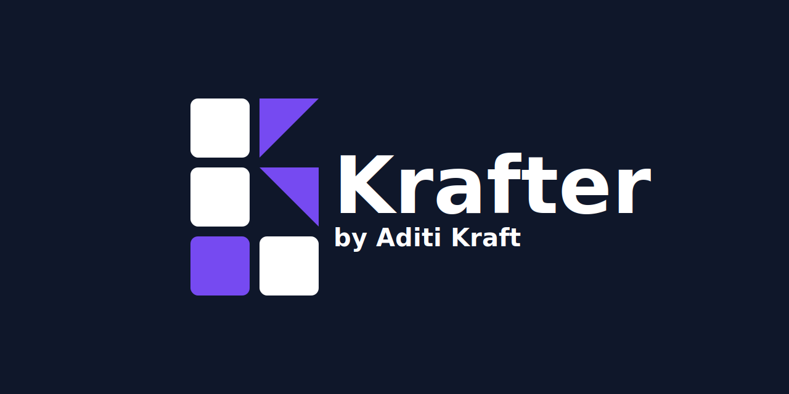
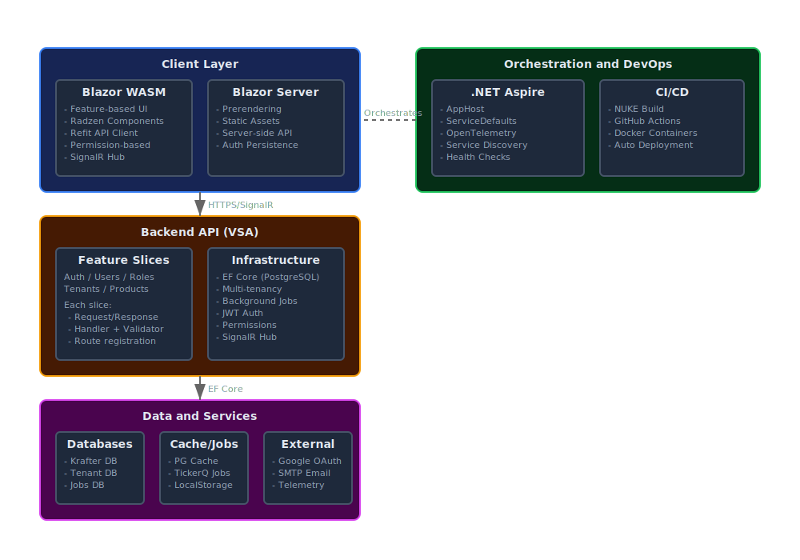
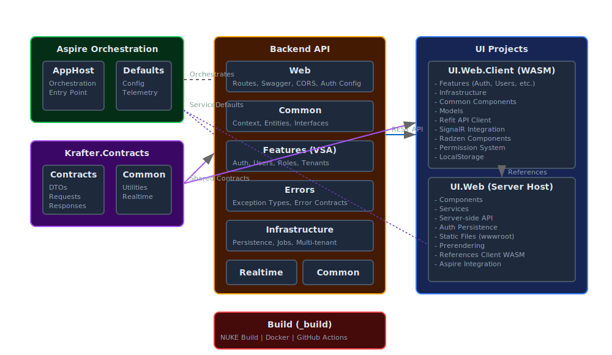

# Krafter

<p align="center">
  
</p>

> A modern .NET 10 full-stack **project template** for building multi-tenant SaaS applications with Vertical Slice Architecture (VSA), Hybrid Blazor, and AI-friendly structure.

[](https://dotnet.microsoft.com/)
[](https://dotnet.microsoft.com/apps/aspnet/web-apps/blazor)
[](LICENSE)

## ⚡ Start Here — Install the Template, Then Create Your App

> **Krafter is used via `dotnet new`.**
>
> You do **not** clone this repository to start an application.
> Clone it only if you want to [contribute to the template itself](#-contributing--template-development).

```bash
# 1. Install the template pack (one-time)
dotnet new install AditiKraft.Krafter.Templates

# 2. Create a new app
dotnet new krafter -n MyApp            # Split Host (separate API + UI)
dotnet new krafter-single -n MyApp     # Single Host (combined)

# 3. Run it
cd MyApp
dotnet run --project aspire/MyApp.Aspire.AppHost/MyApp.Aspire.AppHost.csproj
```

### Template Variants

Krafter ships as a `dotnet new` template pack with two hosting models:

| Template | Command | Best for |
|----------|---------|----------|
| **Split Host** | `dotnet new krafter -n MyApp` | Separate Backend API + Blazor UI, clearer service boundaries, independent scaling |
| **Single Host** | `dotnet new krafter-single -n MyApp` | Combined API + UI, simpler deployment, fewer moving parts |

> Always use `-n` to set your project name — it replaces namespaces, folders, and project files throughout the generated solution.

<details>
<summary><strong>When should I choose each variant?</strong></summary>

**Choose Split Host (`krafter`) when:**
- You want to scale API and UI independently
- Different teams own backend vs frontend
- You expect additional clients such as mobile apps or CLIs
- You prefer explicit service boundaries

**Choose Single Host (`krafter-single`) when:**
- You want the simplest possible deployment
- You prefer a single process and a single Aspire resource
- You want lower operational overhead
- Your team owns the full stack end to end

</details>

### Manage the Template

```bash
dotnet new install AditiKraft.Krafter.Templates   # Install
dotnet new update                                  # Update to latest
dotnet new uninstall AditiKraft.Krafter.Templates  # Uninstall
```

## 🚀 Demo

Try the live demo at [https://krafter.getkrafter.dev/](https://krafter.getkrafter.dev/)

**Default Credentials:**
- Email: `admin@getkrafter.dev`
- Password: `123Pa$$word!`

Alternatively, log in with Google to create a new account.

## 🎯 What Krafter Gives You

Krafter is a **production-ready .NET 10 application template**, not a starter toy project. It gives you a structured foundation for full-stack business apps with modern defaults already wired together.

### Included out of the box

| Area | What you get |
|------|--------------|
| **Architecture** | Vertical Slice Architecture (VSA), feature-based organization, Minimal APIs, clean separation between Contracts, Backend, and UI |
| **Frontend** | Hybrid Blazor (WebAssembly + Server), Radzen UI components, code-behind pattern, responsive layouts, theming support |
| **Security** | JWT authentication, Google OAuth, permission-based authorization, token refresh, ASP.NET Core Identity |
| **Multi-tenancy** | Tenant-aware design with database-level isolation patterns |
| **Data** | Entity Framework Core 10, PostgreSQL / MySQL support, migrations, soft delete, multiple database contexts |
| **Realtime & jobs** | SignalR for live updates, TickerQ for background processing |
| **API consumption** | Refit-based type-safe HTTP clients with token handling |
| **Observability** | .NET Aspire, OpenTelemetry, health checks, structured logging |
| **Delivery** | Docker support, NUKE build automation, GitHub Actions workflows |

### Why teams choose it

- **Template-first workflow** with `dotnet new`
- **Feature-oriented backend structure** that is easier to extend with AI assistance
- **Modern full-stack .NET setup** without spending days on wiring
- **Two hosting models** so you can optimize for simplicity or separation
- **Built-in patterns** for auth, tenants, jobs, realtime, and observability

## 🏛️ Architecture

The diagrams below reflect the template structure and are useful before you generate or contribute to a project.

### Solution Architecture Diagram



### Project Dependencies Diagram



## 🚀 Getting Started

> This section applies to a **generated project** created with `dotnet new krafter` or `dotnet new krafter-single`.
>
> If you want to work on the template repository itself, jump to [Contributing & Template Development](#-contributing--template-development).

### Prerequisites

- [.NET 10 SDK](https://dotnet.microsoft.com/download/dotnet/10.0)
- [Docker Desktop](https://www.docker.com/products/docker-desktop) (for Aspire/PostgreSQL)
- [Visual Studio 2022 17.11+](https://visualstudio.microsoft.com/) or [VS Code](https://code.visualstudio.com/)

### First Run

1. Create a project from the template
   ```bash
   dotnet new krafter -n MyApp
   cd MyApp
   ```

2. Start the AppHost
   ```bash
   dotnet run --project aspire/MyApp.Aspire.AppHost/MyApp.Aspire.AppHost.csproj
   ```

3. Let `myapp-migrator` finish before judging startup health
   - The AppHost starts the short-lived migrator before the main app resources
   - For normal startup, you do **not** need to run `dotnet ef database update` manually

4. Open the generated app
   - **Aspire Dashboard**: https://localhost:17285
   - **Backend API** (split host only): https://localhost:5199
   - **Scalar API Reference** (split host only): https://localhost:5199/scalar/v1
   - **Blazor UI**: https://localhost:7291

5. Sign in with the seeded admin account
   - Email: `admin@getkrafter.dev`
   - Password: `123Pa$$word!`

   Alternatively, log in with Google, which will create a new account.

> ⚠️ Change the default password immediately in production.

<details>
<summary><strong>Database migrations workflow</strong></summary>

AppHost applies checked-in migrations automatically through `krafter-migrator`. In normal local development, start AppHost and let the migrator complete.

The existing `ConnectionStrings:KrafterDbMigration` value in `src/AditiKraft.Krafter.Backend/appsettings.Local.json` already works for `dotnet ef migrations add`. Do not change it.

Install EF Core tools once if needed:

```bash
dotnet tool install --global dotnet-ef
```

Create a migration from the Backend project:

```bash
cd src/AditiKraft.Krafter.Backend

dotnet ef migrations add <MigrationName> --context KrafterContext
dotnet ef migrations add <MigrationName> --context TenantDbContext
dotnet ef migrations add <MigrationName> --context BackgroundJobsContext
```

Then restart AppHost to apply it:

```bash
dotnet run --project aspire/AditiKraft.Krafter.Aspire.AppHost/AditiKraft.Krafter.Aspire.AppHost.csproj
```

</details>

<details>
<summary><strong>Troubleshooting</strong></summary>

| Issue | Cause | Solution |
|-------|-------|----------|
| "Unable to create DbContext" | Missing `ConnectionStrings:KrafterDbMigration` or wrong working directory | Restore the `KrafterDbMigration` entry in `appsettings.Local.json` and run the command from `src/AditiKraft.Krafter.Backend` |
| "`krafter-api` does not start" | `krafter-migrator` failed first | Check the `krafter-migrator` logs and fix the migration error |
| "Migration already exists" | Duplicate migration name | Use `dotnet ef migrations remove --context <ContextName>` |
| "Pending model changes" | The model changed but no migration exists yet | Add a new migration for the affected context before restarting AppHost |
| `dotnet-ef` not found | EF tools not installed | Run `dotnet tool install --global dotnet-ef` |

</details>

<details>
<summary><strong>Configuration notes</strong></summary>

Local development works with the checked-in dev settings.

Only change configuration if you need custom values for:

- PostgreSQL container credentials in `aspire/AditiKraft.Krafter.Aspire.AppHost/appsettings.json`
- JWT, TickerQ, or Google auth settings in `src/AditiKraft.Krafter.Backend/appsettings.json`
- UI backend URL or Google client settings in `src/UI/AditiKraft.Krafter.UI.Web/appsettings.Development.json` and `src/UI/AditiKraft.Krafter.UI.Web.Client/wwwroot/appsettings.json`

For anything outside local development, prefer user-secrets or environment variables instead of committed values.

</details>

## 📁 Project Structure

The structure below is what you get after running `dotnet new krafter -n MyApp` (split host). Single host is identical except Backend has no `Program.cs`.

```text
MyApp/
├── Agents.md                            # AI agent instructions (entry point)
├── aspire/                              # Aspire orchestration
│   ├── MyApp.Aspire.AppHost/
│   └── MyApp.Aspire.ServiceDefaults/
├── src/
│   ├── MyApp.Contracts/                 # Shared contracts library
│   │   ├── Contracts/                   # Auth, Users, Roles, Tenants DTOs
│   │   ├── Common/                      # Routes, permissions, shared models
│   │   └── Realtime/                    # SignalR method contracts
│   ├── MyApp.Backend/                   # ASP.NET Core API (VSA)
│   │   ├── Web/                         # HTTP pipeline, middleware, auth config
│   │   ├── Features/                    # Vertical slices
│   │   ├── Infrastructure/              # Jobs, notifications, persistence, realtime
│   │   ├── Common/                      # Context, entities, interfaces, extensions
│   │   ├── Errors/                      # Exception types
│   │   ├── Migrations/                  # EF Core migrations
│   │   └── Program.cs                   # (split host only)
│   ├── MyApp.Backend.Migrator/          # Short-lived EF migration runner
│   └── UI/
│       ├── MyApp.UI.Web.Client/         # Blazor WebAssembly
│       │   ├── Features/
│       │   ├── Infrastructure/          # AuthApi, Refit, SignalR, Storage, Http
│       │   └── Common/                  # Shared components, models
│       └── MyApp.UI.Web/               # Blazor Server host (or combined host in single mode)
├── build/                               # NUKE build automation
├── docs/                                # Documentation assets
├── .github/                             # GitHub Actions workflows
└── README.md
```

## 📖 Development Guide

If you are using Krafter to build an app, the main workflow is:

1. Generate a project with `dotnet new krafter` or `dotnet new krafter-single`
2. Run the AppHost
3. Add features in the existing Contracts / Backend / UI structure
4. Create migrations when your model changes
5. Let the migrator apply them on the next AppHost start

For detailed feature-by-feature instructions, naming conventions, and backend/UI implementation rules, use [Agents.md](Agents.md) and the related files in:
- `src/AditiKraft.Krafter.Backend/`
- `src/UI/`
- `src/AditiKraft.Krafter.Contracts/`

### Key Commands

```bash
# Build solution
dotnet build AditiKraft.Krafter.slnx

# Run tests
dotnet test

# Create migrations
dotnet ef migrations add <Name> --project src/AditiKraft.Krafter.Backend --context KrafterContext
dotnet ef migrations add <Name> --project src/AditiKraft.Krafter.Backend --context BackgroundJobsContext
dotnet ef migrations add <Name> --project src/AditiKraft.Krafter.Backend --context TenantDbContext

# Apply migrations through the dedicated migrator
dotnet run --project aspire/AditiKraft.Krafter.Aspire.AppHost/AditiKraft.Krafter.Aspire.AppHost.csproj
```

## 🐳 Deployment

### Docker Deployment

Build container images with:

```bash
dotnet publish src/AditiKraft.Krafter.Backend/AditiKraft.Krafter.Backend.csproj -c Release -p:PublishProfile=DefaultContainer
dotnet publish src/UI/AditiKraft.Krafter.UI.Web/AditiKraft.Krafter.UI.Web.csproj -c Release -p:PublishProfile=DefaultContainer
```

### CI/CD with GitHub Actions

The project includes GitHub Actions workflows for:
- Building and testing on every push
- Creating Docker images for `main` and `dev` branches
- Pushing images to GitHub Container Registry
- Triggering deployment webhooks

See [.github/workflows](.github/workflows) for configuration.

## 🤝 Contributing & Template Development

> **Clone this repository only if you want to work on the Krafter template itself.**
>
> If you want to create an application, use `dotnet new krafter` or `dotnet new krafter-single`.

### Clone the Template Repo

```bash
git clone https://github.com/AditiKraft/Krafter.git
cd Krafter
dotnet restore
```

<details>
<summary><strong>Template repo structure (beyond the generated output)</strong></summary>

The template repository contains extra folders that are **not** included in generated projects:

```text
AditiKraft.Krafter/                         # Template repo root
├── .template.config/                       # Split-host template definition
├── .template.config-single/                # Single-host template definition
├── src-single/                             # Single-host overrides (Program.cs, csproj, appsettings)
│   └── UI/AditiKraft.Krafter.UI.Web/       #   Overlaid into src/UI/ during template generation
├── aspire-single/                          # Single-host Aspire AppHost override
│   └── AditiKraft.Krafter.Aspire.AppHost/  #   Overlaid into aspire/ during template generation
├── Agents.md                               # Template developer instructions
├── Agents.split.md                         # Renamed to Agents.md in split-host output
├── Agents.single.md                        # Renamed to Agents.md in single-host output
├── AditiKraft.Krafter.slnx                 # Split-host solution
├── AditiKraft.Krafter.Single.slnx          # Single-host solution
├── AditiKraft.Krafter.Templates.csproj     # NuGet template packaging
└── pack-and-install.cmd                    # Local pack + install helper
```

</details>

### Run the Template Locally

```bash
# Split-host solution (default)
dotnet run --project aspire/AditiKraft.Krafter.Aspire.AppHost/AditiKraft.Krafter.Aspire.AppHost.csproj

# Single-host solution
dotnet run --project aspire-single/AditiKraft.Krafter.Aspire.AppHost/AditiKraft.Krafter.Aspire.AppHost.csproj
```

### Test Template Output Locally

```bash
# Pack the template
dotnet pack AditiKraft.Krafter.Templates.csproj -o ./nupkg

# Install from local pack
dotnet new install ./nupkg/AditiKraft.Krafter.Templates.*.nupkg

# Create test projects
dotnet new krafter -n TestApp -o ../TestApp
dotnet new krafter-single -n TestSingle -o ../TestSingle
```

### Contribution Notes

- Follow the coding conventions in [Agents.md](Agents.md) and the relevant sub-project `Agents.md` files
- Open changes through a Pull Request
- Use [Conventional Commits](https://www.conventionalcommits.org/)

```text
feat(scope): add new feature
fix(scope): fix bug
docs(scope): update documentation
refactor(scope): refactor code
test(scope): add tests
```

---

## 📄 License, Support, and Thanks

- **License**: MIT — see [LICENSE](LICENSE)
- **Documentation**: [Agents.md](Agents.md)
- **Issues**: [GitHub Issues](https://github.com/AditiKraft/Krafter/issues)
- **Discussions**: [GitHub Discussions](https://github.com/AditiKraft/Krafter/discussions)

**Acknowledgments**
- [.NET Team](https://github.com/dotnet) - For the amazing .NET platform
- [Radzen](https://www.radzen.com/) - For the excellent Blazor components
- [Refit](https://github.com/reactiveui/refit) - For the type-safe REST client
- [NUKE Build](https://nuke.build/) - For the build automation framework

<div align="center">

**Built with ❤️ by [Aditi Kraft](https://github.com/AditiKraft)**

⭐ Star this repository if you find it helpful!

</div>
